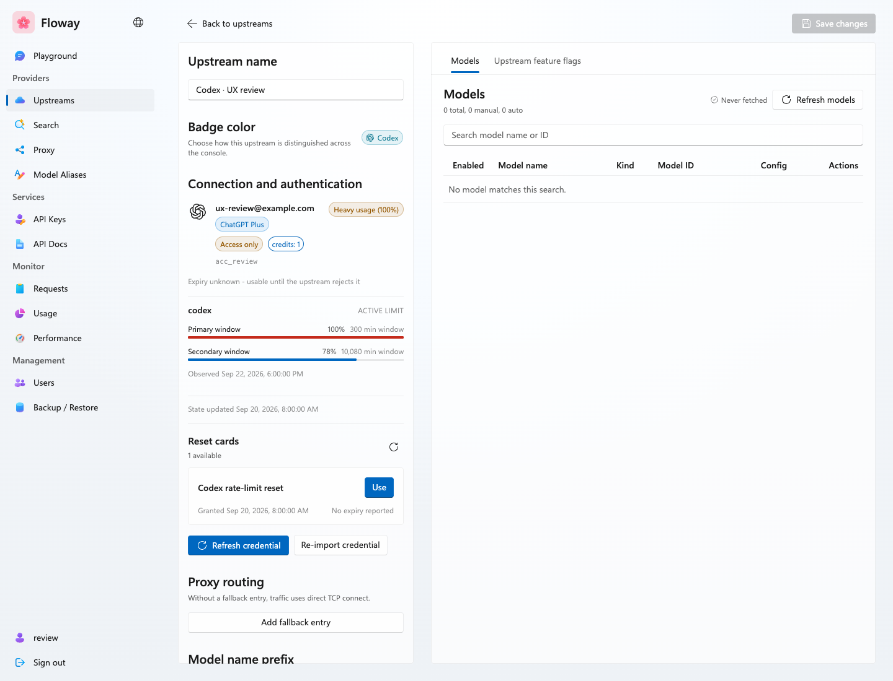
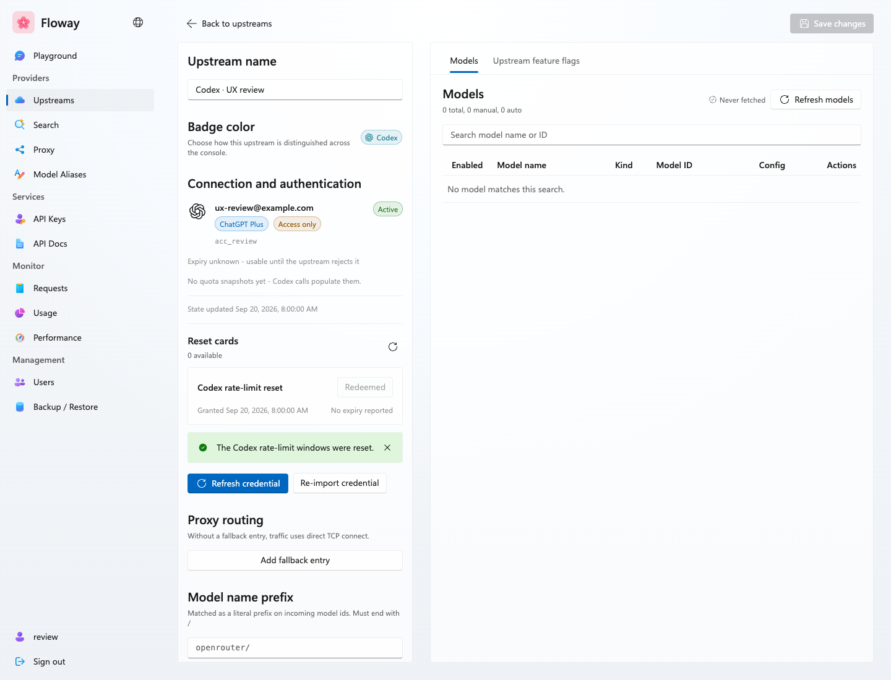
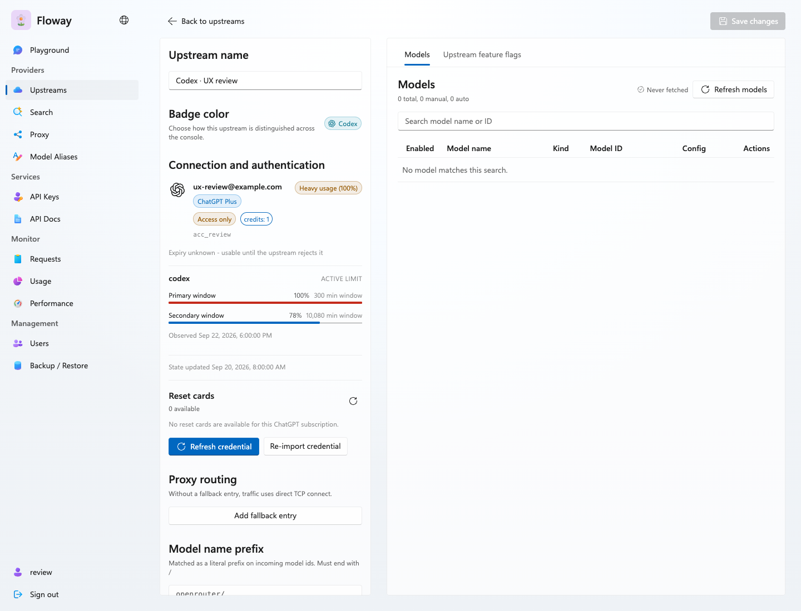
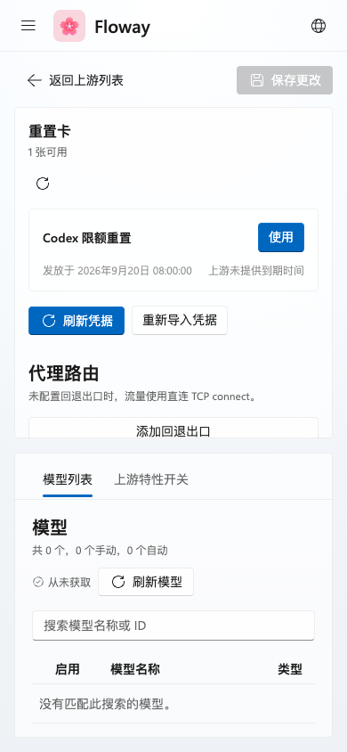
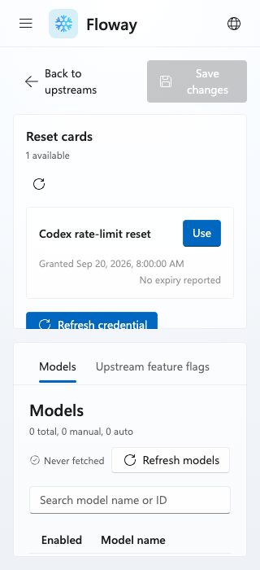

# Floway PR #528 Screenshots

Production Web build at `586717108a12f80daf060fe30c111718071df120`, rendered with synthetic API responses. No real reset card was consumed.

These review artifacts belong to https://github.com/Menci/Floway/pull/528 and are kept outside the product branch.

Screenshots cover the available action, confirmation, pending redemption, success with a disabled Redeemed button, empty list, list failure, redemption failure, expiry, dark theme, a 390px Simplified Chinese viewport, and a 320px English viewport.

`pnpm run verify` passed: 576 test files, 6,200 tests, 63 installer checks passed and 47 host-dependent skips. Type generation, lint, typechecks, repository invariant checks, and production Web build passed.

Browser checks: title and action centers and expiry right edges differ by zero CSS pixels at desktop, 390px Chinese, and 320px English widths. Cancellation sent zero consume requests; success sent one; three retry attempts shared one idempotency key; redeemed action disabled; no page errors, unexpected requests, or mobile horizontal overflow.

